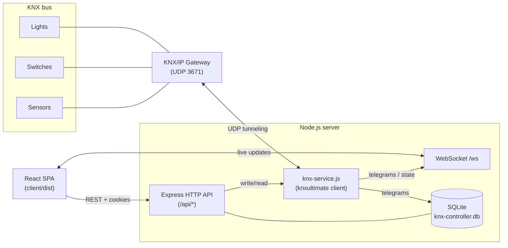

# Domotica PLC

> **KNX home & office automation controller with a realtime web UI.**
> A self-contained Node.js + React stack that talks to a KNX/IP gateway, auto-discovers devices on the bus, and lets you organise and operate them from a clean dashboard.

[](https://nodejs.org)
[](./LICENSE)
[](#tech-stack)

---

## Table of contents

- [What it does](#what-it-does)
- [Screenshots](#screenshots)
- [Architecture](#architecture)
- [Tech stack](#tech-stack)
- [Quick start](#quick-start)
- [Prerequisites](#prerequisites)
- [Installation](#installation)
- [Configuration (`.env`)](#configuration-env)
- [Running](#running)
  - [Development (Vite HMR)](#development-vite-hmr)
  - [Production (bare metal + PM2)](#production-bare-metal--pm2)
  - [Docker](#docker)
- [HTTP API reference](#http-api-reference)
- [WebSocket protocol](#websocket-protocol)
- [Project layout](#project-layout)
- [Security notes](#security-notes)
- [Troubleshooting](#troubleshooting)
- [Roadmap / known limitations](#roadmap--known-limitations)
- [License](#license)

---

## What it does

Domotica PLC connects to a **KNX/IP gateway** over UDP tunneling and acts as a thin, opinionated control plane:

- **Listens** to every telegram on the bus and stores a rolling history in SQLite.
- **Auto-discovers** physical devices (by source address) and group addresses (by destination address) the first time they appear on the bus.
- **Lets you name and group them** into rooms, with friendly labels, icons and a controllable/read-only flag.
- **Pushes realtime updates** to the web UI over WebSocket — state changes show up instantly.
- **Sends writes** back to the bus (on/off, toggle, raw value) from any browser, authenticated.
- **Cancels bus noise during discovery**: an adaptive Learn flow fingerprints the noise floor, then surfaces only the telegrams that differ from it, so a single button press is no longer lost in 3–4 telegrams/sec of chatter.
- **Maps the installation passively**: a read-only topology scanner fingerprints every group address (GroupValueRead + history analysis) and infers command/status roles, datapoint types and command↔feedback pairings — without actuating anything.

It's designed to be the small "always on" service that lives next to the KNX gateway on the LAN — single binary's worth of moving parts, no external database, no cloud.

---

## User interface

A dark, focused dashboard built with Tailwind and Lucide icons. Six screens:

- **Login** — single-user form, redirects to the dashboard once the JWT cookie is set.
- **Dashboard** — devices grouped by room, each with a live ON/OFF chip. Headline counters at the top: total devices, active, off.
- **Devices** — flat searchable table of every configured group address with type, address, room and live status. Inline edit / delete.
- **Rooms** — manage rooms (name, icon, sort order). Deleting a room moves its devices to the system *Uncategorized* room.
- **Discovery** — the adaptive Learn flow on top (calibrate the noise floor, then see only novel events with reason-coded chips, a live sensitivity slider and an actuator-echo filter), with the passive live-bus tail and the unconfigured-address table below as references.
- **Topology** — the inferred infrastructure map, grouped by KNX main group: each address shows its category, command/status role, datapoint type, a confidence bar and the rationale behind the guess. Labels are inline-editable so a human stays in the loop.

A persistent sidebar shows WebSocket status and KNX gateway health (gateway IP + online/offline badge). Realtime updates: when something changes on the bus, the relevant card flips state without a page refresh, thanks to the WebSocket → TanStack Query invalidation pipeline.

---

## Architecture



- **`knxultimate`** handles the KNX/IP tunneling protocol; the server wraps it in an `EventEmitter` with auto-reconnect and a SQLite-backed history.
- **Express** exposes a small REST API, **`ws`** streams telegram events to authenticated clients, and **React + TanStack Query** keeps the UI in sync.
- **SQLite** (via `better-sqlite3`) holds rooms, devices, group addresses and a 7-day telegram history. WAL mode is enabled for safe concurrent reads.

---

## Infrastructure discovery: passive mapping driven by a coding agent

Commissioning an unknown KNX installation by hand is slow and error-prone: you
would have to walk to every device, press it, and watch which address moves —
hopeless on a bus that already carries 3–4 telegrams per second of unrelated
traffic. Domotica PLC instead exposes a **read-only discovery toolkit** that an
operator drives together with a **coding agent** (e.g. an AI agent running on
the box) in a "four-hands" loop. The agent orchestrates the probes, reads the
evidence, interprets it, and writes the result back; the human reviews and
confirms in the Topology UI.

The bus interaction is strictly **passive** — the only primitive used is
`GroupValueRead`, which asks a device for its current state and never changes
it. There is deliberately **no write/toggle path** in the topology module:
actively driving loads during mapping is unsafe when you don't yet know what
each address controls.

How meaning is inferred, by combining several passive signals:

| Signal | What it reveals |
| --- | --- |
| **Read/write asymmetry** | A GA that answers `GroupValueRead` is a *status/feedback* object; one that is written but never answers is a *command* object. This separates pushbuttons from the loads they drive. |
| **Payload width + value distribution** (from history) | Narrows the datapoint type (1-bit switch, 1-byte scaling, 2-byte float, …). |
| **Co-activation correlation** (telegrams firing within ~1.2 s) | Pairs a command GA with the status GA it drives — the same echo relationship the Learn flow exploits. |
| **Address structure** (main/middle/sub) | Groups addresses into functional blocks and lines. |

The workflow, end to end:

1. **Scan** — `POST /api/topology/scan` sweeps the known group addresses with
   `GroupValueRead`, recording who answers and the payload width. Coverage is
   logged explicitly (which ranges were and were not probed — never silently
   truncated).
2. **Gather evidence** — `GET /api/topology/evidence` returns, per address, the
   probe result plus history-derived stats (who writes it, distinct values,
   top co-activation partners).
3. **Interpret** — the coding agent classifies each address: role, datapoint
   type, category, a confidence score and a short rationale.
4. **Write back** — `PATCH /api/topology/classify` stores the classification in
   the `ga_inference` table (kept separate from the user-facing
   `group_addresses` record, so the mapping is fully reversible) and optionally
   promotes a name/type onto the device.
5. **Review** — the **Topology** page renders the assembled map with confidence
   bars and rationales; the human corrects names inline.

**Honest limitation:** a 1-bit on/off load cannot be told apart as *light* vs
*socket* from passive data alone. Role, command↔feedback pairing and datapoint
type are high-confidence; the semantic category is a hint to be confirmed by a
person. Disambiguating further would need either an ETS project export or an
opt-in *active* probe (toggling loads and watching feedback), which is
intentionally **not** part of this passive toolkit.

---

## Tech stack

| Layer | Choice | Why |
| --- | --- | --- |
| Runtime | **Node.js 20+** (tested on 22 LTS) | First-class `--watch`, modern ESM |
| Bus client | [`knxultimate`](https://www.npmjs.com/package/knxultimate) | Mature KNX/IP implementation |
| HTTP | **Express 4** | Battle-tested, plays well with cookies + WS |
| Realtime | **`ws`** (raw WebSocket) | Lower overhead than Socket.io, JWT-auth at handshake |
| Validation | **Zod** | Schema-checks every request body |
| Storage | **better-sqlite3** | Sync, embedded, no extra service to run |
| Auth | **JWT** in HttpOnly cookie + Bearer header | Simple single-user setup |
| Frontend | **React 18 + Vite 6** | Fast dev loop, tiny prod bundle (~85 KB gzipped) |
| State | **TanStack Query** + React hooks | Cache invalidation on WS events |
| Styling | **Tailwind CSS** + Lucide icons | Dark-first UI |

---

## Quick start

```bash
git clone https://github.com/<your-user>/domotica-plc.git
cd domotica-plc

cp .env.example .env
$EDITOR .env                       # set KNX_GATEWAY_IP, AUTH_PASSWORD, SESSION_SECRET

npm install                        # server deps
npm run build                      # installs + builds the React client

npm start                          # http://localhost:3000
```

The first run creates `knx-controller.db` next to the project. Open the URL, log in with the credentials from `.env`, and the bus will start populating the *Discovery* tab as soon as the gateway is reachable.

---

## Prerequisites

### On the target server

| What | Why | Install |
| --- | --- | --- |
| **Node.js 20+** (22 LTS recommended) | runs the server | `curl -fsSL https://deb.nodesource.com/setup_22.x \| sudo -E bash - && sudo apt install nodejs` |
| **Python 3 + build-essential** | `better-sqlite3` compiles natively | `sudo apt install -y build-essential python3` |
| **git** | clone the repo | `sudo apt install -y git` |
| **PM2** *(optional)* | restart on crash + boot | `sudo npm install -g pm2` |
| **Docker + compose v2** *(optional)* | containerised deploy | `sudo apt install -y docker.io docker-compose-v2` |

### Network requirements

- The server must reach the KNX/IP gateway over **UDP 3671** (KNX tunneling).
- The server's NIC must sit on the **same LAN as the gateway**, or have UDP forwarding to it.
- The browser reaches the server over the HTTP/WebSocket port you choose with `PORT` (default `3000`).
- If the host has multiple interfaces, set `KNX_LOCAL_IP` to the IP of the one on the KNX subnet.

You do **not** need a separate database server — SQLite is embedded.

---

## Installation

```bash
# 1. Clone
git clone https://github.com/<your-user>/domotica-plc.git
cd domotica-plc

# 2. Secrets
cp .env.example .env
$EDITOR .env

# 3. Generate a strong SESSION_SECRET and paste it into .env
node -e "console.log(require('crypto').randomBytes(48).toString('hex'))"

# 4. Install + build
npm install
npm run build
```

`npm run build` is a shortcut for `npm run client:install && npm run client:build` — it installs the React client's deps and emits the production bundle into `client/dist/`, which the Express server serves as static assets.

---

## Configuration (`.env`)

Every option lives in [`.env.example`](./.env.example). Highlights:

| Variable | Required | Default | Notes |
| --- | --- | --- | --- |
| `KNX_GATEWAY_IP` | **yes** | — | IPv4 of the KNX/IP router/interface |
| `KNX_GATEWAY_PORT` | no | `3671` | UDP port (KNX/IP standard) |
| `KNX_LOCAL_IP` | no | auto | Force the local NIC for tunneling |
| `KNX_LOGLEVEL` | no | `info` | `error` / `warn` / `info` / `debug` / `trace` |
| `PORT` | no | `3000` | HTTP/WebSocket port |
| `NODE_ENV` | no | `development` | Set to `production` on the server |
| `CORS_ORIGIN` | no | *(same-origin only)* | Comma-separated list of allowed origins |
| `AUTH_USERNAME` | no | `admin` | Single login username |
| `AUTH_PASSWORD` | **yes** | — | Plaintext password (kept only in `.env`) |
| `SESSION_SECRET` | **yes in prod** | random in dev | ≥32 chars, must differ from the placeholder |

The server **refuses to start in production** if `SESSION_SECRET` is missing, a known placeholder, or shorter than 32 characters. In `NODE_ENV=development` it falls back to a random per-run secret with a warning (tokens get invalidated on every restart).

---

## Running

### Development (Vite HMR)

Two terminals — backend on `3000`, Vite dev server on `5173`:

```bash
# terminal 1 — backend with --watch
npm run dev

# terminal 2 — React with hot module reload
npm run client:dev
```

Open <http://localhost:5173>. Vite proxies `/api` and `/ws` to the backend, so you get HMR on the SPA without touching the server.

### Production (bare metal + PM2)

```bash
npm install
npm run build

pm2 start ecosystem.config.cjs
pm2 save
pm2 startup           # follow the printed command once to enable boot
```

Logs go to `./logs/out.log` and `./logs/error.log`. Inspect them with `pm2 logs domotica-plc`.

To update later:

```bash
git pull
npm install
npm run build
pm2 restart domotica-plc
```

### Docker

```bash
cp .env.example .env
# edit .env, then:
docker compose up -d --build
docker compose logs -f
```

The compose file uses `network_mode: host` so the container can talk UDP to the KNX gateway. The SQLite database lives in the `knx-data` named volume.

For a development container with hot reload:

```bash
docker compose -f docker-compose.dev.yml up
```

### Optional: reverse proxy + HTTPS

The repo ships an example `nginx/nginx.conf` you can use as a starting point. Drop your TLS certificate and key into `nginx/ssl/` (git-ignored) and uncomment the HTTPS server block. The Express server already sets `secure` cookies when `NODE_ENV=production` and trusts `X-Forwarded-*` headers (`trust proxy: 1`).

---

## HTTP API reference

All endpoints live under `/api`. Authentication is required for everything except `/api/auth/login`, `/api/auth/status` and `/api/health`. Credentials are sent as an HttpOnly `token` cookie (set by `/auth/login`) or as `Authorization: Bearer <jwt>`.

### Health & status

| Method | Path | Description |
| --- | --- | --- |
| `GET` | `/api/health` | Liveness probe, no auth |
| `GET` | `/api/status` | KNX connection state + connected WS clients |

### Auth

| Method | Path | Body | Description |
| --- | --- | --- | --- |
| `POST` | `/api/auth/login` | `{username, password}` | Returns JWT + sets cookie. Rate-limited (10/15min/IP) |
| `POST` | `/api/auth/logout` | — | Clears the cookie |
| `GET` | `/api/auth/status` | — | `{authenticated, user?}` |

### Rooms

| Method | Path | Description |
| --- | --- | --- |
| `GET` | `/api/rooms` | List rooms with device counts |
| `POST` | `/api/rooms` | Create a room |
| `PUT` | `/api/rooms/:id` | Rename / re-icon / reorder |
| `DELETE` | `/api/rooms/:id` | Delete (devices fall back to *Uncategorized*) |

### Devices (physical KNX devices)

| Method | Path | Description |
| --- | --- | --- |
| `GET` | `/api/devices` | List with linked group addresses |
| `GET` | `/api/devices/:id` | Single device |
| `GET` | `/api/devices/by-address/:address` | Lookup by physical address (e.g. `1.1.10`) |
| `PUT` | `/api/devices/:id` | Update name / description / room |

### Group addresses

| Method | Path | Description |
| --- | --- | --- |
| `GET` | `/api/group-addresses` | All group addresses |
| `GET` | `/api/group-addresses?configured=true` | Only those with a name set |
| `GET` | `/api/group-addresses/discovered` | Seen on the bus, not yet configured |
| `GET` | `/api/group-addresses/by-address/:address` | Lookup by `m/s/g` |
| `POST` | `/api/group-addresses` | Manually create |
| `PUT` | `/api/group-addresses/:id` | Configure (name, type, room, icon, …) |
| `DELETE` | `/api/group-addresses/:id` | Remove |

### Control

| Method | Path | Body | Description |
| --- | --- | --- | --- |
| `POST` | `/api/control/:address` | `{value, dataType?}` | Write any value |
| `POST` | `/api/control/:address/on` | — | DPT1 → `true` |
| `POST` | `/api/control/:address/off` | — | DPT1 → `false` |
| `POST` | `/api/control/:address/toggle` | — | Flip current boolean state |
| `GET` | `/api/control/:address/read` | — | Send a read request, observe via WS |

### History

| Method | Path | Description |
| --- | --- | --- |
| `GET` | `/api/history?limit=100` | Most recent telegrams |
| `GET` | `/api/history?address=1/1/142&limit=50` | Per group address |

### Learn (adaptive noise-cancelling discovery)

| Method | Path | Body | Description |
| --- | --- | --- | --- |
| `GET` | `/api/learn/state` | — | Engine state + noise-profile stats |
| `GET` | `/api/learn/profile` | — | Full list of tracked noise signatures |
| `POST` | `/api/learn/baseline/start` | `{durationMs?}` | Start calibrating the noise floor |
| `POST` | `/api/learn/baseline/extend` | `{durationMs}` | Push the calibration deadline |
| `POST` | `/api/learn/baseline/stop` | — | Cut calibration short |
| `DELETE` | `/api/learn/baseline` | — | Wipe the noise profile |
| `POST` | `/api/learn/baseline/exclude` | `{dst}` | Force a GA to never count as noise |
| `POST` | `/api/learn/start` | `{threshold?, echoFilter?}` | Enter Learn mode |
| `PATCH` | `/api/learn/threshold` | `{threshold}` | Tune sensitivity live |
| `PATCH` | `/api/learn/echo-filter` | `{enabled}` | Toggle actuator-echo suppression |
| `POST` | `/api/learn/stop` | — | End the session, return detections |

### Topology (passive infrastructure mapping)

| Method | Path | Body | Description |
| --- | --- | --- | --- |
| `POST` | `/api/topology/scan` | `{addresses?, spacingMs?, timeoutMs?, includeSweep?}` | Passive `GroupValueRead` sweep (read-only) |
| `GET` | `/api/topology/evidence` | — | Per-GA probe results + history stats + correlations |
| `PATCH` | `/api/topology/classify` | `{items:[…]}` | Write back role / DPT / category / confidence |
| `GET` | `/api/topology/map` | — | Assembled map grouped by main group |

---

## WebSocket protocol

Connect to `ws(s)://<host>/ws`. The handshake **requires authentication** — either send the `token` cookie (the browser does this automatically once logged in) or append `?token=<jwt>` to the URL.

The server sends JSON messages of the form `{type, data}`:

| `type` | When | `data` |
| --- | --- | --- |
| `connection_status` | on connect / KNX state change | `{connected, gateway, port, reconnectAttempts}` |
| `telegram` | every received KNX telegram | `{src, dst, type, rawHex, decodedValue, timestamp}` |
| `state_change` | on `GroupWrite` / `GroupResponse` | `{address, value, rawHex, mapped}` |
| `device_discovered` | first time we see a physical address | full device row |
| `group_address_discovered` | first time we see a group address | full GA row |
| `write_success` / `write_error` | result of `/api/control/*` | `{address, value, error?}` |
| `learn_state` | Learn engine transition / on connect | full state summary |
| `learn_calibrating` | ~2 Hz during calibration | `{remainingMs, telegramsSeen, newGas, …}` |
| `learn_detection` | a telegram passes the noise filter | the detection record |

> `state_change` carries a `mapped` flag: the client only refetches data for
> changes to *configured* addresses, so unmapped bus chatter never triggers a
> request. Invalidations are also coalesced into one flush per 800 ms window.

The client sends `{type: 'ping'}` (server replies `{type: 'pong'}`) and `{type: 'get_status'}`.

---

## Project layout

```
.
├── client/                 # React SPA (Vite)
│   ├── src/
│   │   ├── api/            # Fetch wrapper (cookies + JSON)
│   │   ├── components/     # Layout, modals, cards
│   │   ├── hooks/          # useWebSocket, useDevices
│   │   ├── pages/          # Dashboard, Devices, Rooms, Discovery, Login
│   │   ├── App.jsx
│   │   └── main.jsx
│   ├── tailwind.config.js
│   └── vite.config.js
├── server/                 # Node.js backend
│   ├── routes/             # auth, rooms, devices, group-addresses, control
│   ├── utils/              # rate-limit, knx-datapoints
│   ├── auth.js             # JWT + timing-safe credential check
│   ├── database.js         # SQLite schema + repositories
│   ├── knx-service.js      # knxultimate wrapper, auto-discovery, reconnect
│   ├── websocket.js        # ws server, broadcasts KNX events
│   └── index.js            # entrypoint, middleware, lifecycle
├── nginx/                  # Optional reverse-proxy config
├── Dockerfile              # multi-stage production image
├── Dockerfile.dev          # dev image with HMR
├── docker-compose.yml      # prod compose (host network)
├── docker-compose.dev.yml  # dev compose
├── ecosystem.config.cjs    # PM2 process definition
├── .env.example            # documented sample env
└── package.json
```

---

## Security notes

What's already in place:

- **JWT in HttpOnly cookie**, `SameSite=Strict`, `Secure` when `NODE_ENV=production`.
- **Timing-safe credential comparison** (`crypto.timingSafeEqual`) — no string-compare leaks.
- **Brute-force protection** on `/api/auth/login` (10 attempts / 15 min / IP, app-level).
- **Strict CORS**: `origin: false` unless `CORS_ORIGIN` explicitly lists trusted hosts. `Access-Control-Allow-Credentials: true` is never paired with `origin: *`.
- **SESSION_SECRET hardening**: the server refuses to start in production with a missing, short, or placeholder secret.
- **Zod validation** on every request body.
- **WebSocket auth at handshake** — unauthenticated sockets are closed with code `4001`.
- **`trust proxy: 1`** so rate-limiting and `Secure` cookies behave correctly behind nginx.

What you should still consider before exposing this to the open internet:

- Put it behind **HTTPS** (nginx + Let's Encrypt, Caddy, Traefik — your pick).
- Rotate `AUTH_PASSWORD` and `SESSION_SECRET` periodically.
- Keep the server on a **private VLAN** with the KNX gateway; only the reverse proxy should be reachable from the outside.
- Run `npm audit` and `npm update` regularly.

---

## Troubleshooting

**The server starts but the KNX gateway stays "Offline" in the UI.**
- The server keeps retrying every 5–25 s and logs each attempt. Check that the gateway IP is reachable: `nc -uvz <KNX_GATEWAY_IP> 3671`.
- On a host with multiple NICs, set `KNX_LOCAL_IP` to force the right interface.
- Inside Docker, make sure you're using `network_mode: host` (already set in the provided compose files).

**`better-sqlite3` fails to install.**
- Ensure `python3` and a C++ toolchain are installed (`build-essential` on Debian/Ubuntu, `python3 make g++` on Alpine).
- Node version mismatch is the next suspect — `node -v` must be ≥ 20.

**Login always fails with "Invalid credentials".**
- Confirm `AUTH_PASSWORD` is actually set in `.env` (the server logs a warning if it isn't).
- Restart the server after editing `.env`.

**Cookies don't stick on Safari / iOS.**
- The cookie is `SameSite=Strict`. If you serve the SPA from a different origin than the API, set `CORS_ORIGIN` correctly and put the whole stack behind HTTPS — Safari refuses `Secure` cookies over plain HTTP.

**WebSocket disconnects loops in the browser console.**
- Usually means the JWT expired (24 h). Log out and log back in.

---

## Roadmap / known limitations

- **Telegram decoder currently understands DPT1 only** (1-bit boolean — switches, motion sensors). Dimmers (DPT3), scaling (DPT5), 2-byte float (DPT9, e.g. temperature) etc. are *received* and *stored* as raw hex but not decoded to a friendly value yet.
- **Single user**. No multi-user/roles. Good enough for a home or a single-tenant office; bring something like Authelia or OAuth in front of nginx if you need more.
- **No automated tests yet** — manual smoke test only. Likely targets: `auth.js` (timing-safe equality), `knx-service.js` (reconnect state machine), control routes.
- **No metrics endpoint**. Easy to bolt on `prom-client` next to `/api/health`.

PRs welcome.

---

## License

[MIT](./LICENSE) © 2026 Simone Montanari
